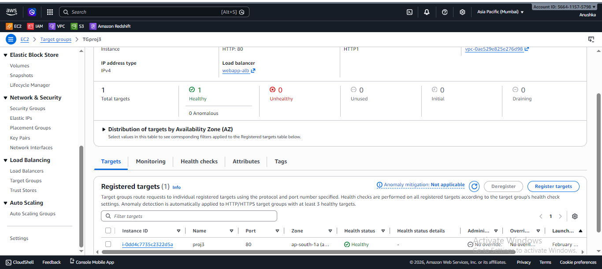
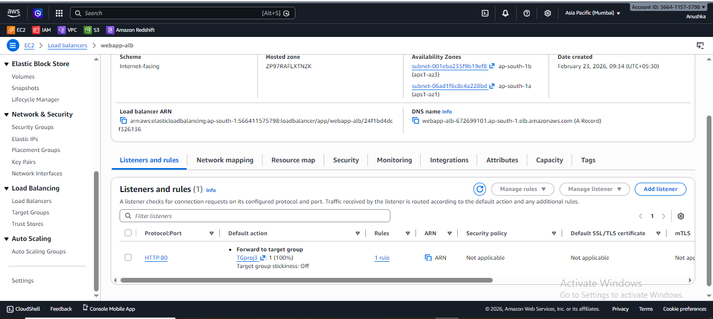
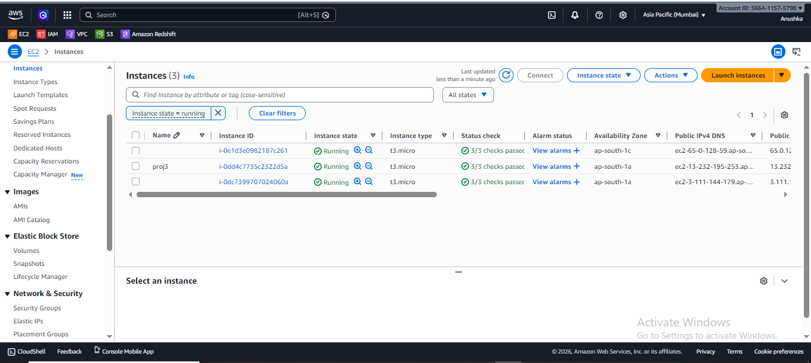

📖 Project Overview

This project demonstrates the design and deployment of a highly available and scalable web application architecture on AWS. It integrates compute, load balancing, auto scaling, object storage, and data warehousing services to simulate a production-ready cloud environment.

*The architecture ensures*

->High Availability
->Fault Tolerance
->Elastic Scaling
->Secure Data Access
->Optimized Analytical Processing

🏗️ Architecture Diagram
`Users
   |
   v
Application Load Balancer (ALB)
   |
   v
Auto Scaling Group (EC2 Instances across Multi-AZ)
   |
   v
Application Logs / Data
   |
   v
Amazon S3 (Staging Layer)
   |
   v
Amazon Redshift (Data Warehouse - OLAP)`

🧰 Services Used

-Amazon EC2
-Application Load Balancer (ALB)
-Auto Scaling Group (ASG)
-Amazon S3
-Amazon Redshift
-IAM (Identity and Access Management)
-CloudWatch (Monitoring)

🚀 Implementation Steps:

1️⃣ Web Application Deployment

-Launched EC2 instance (Amazon Linux)
-Installed Apache Web Server
-Hosted sample web application
-Created AMI from configured instance

2️⃣ Load Balancer Configuration

-Created Application Load Balancer (Layer 7 - HTTP)
-Created Target Group

-Attached EC2 instances to Target Group
-Enabled health checks

Purpose:

~Distribute incoming traffic
~Improve fault tolerance

3️⃣ Auto Scaling Setup

-Created Launch Template using custom AMI
-Configured Auto Scaling Group
-Deployed instances across multiple Availability Zones
-Configured Target Tracking Scaling Policy (CPU-based)

Scaling Configuration:

Minimum instances: 2
Desired instances: 2
Maximum instances: 4
Target CPU Utilization: 60%

Purpose:

Elastic scaling
High availability
Automatic failure recovery

4️⃣ Data Storage Using S3

-Created S3 bucket for application logs
-Uploaded structured CSV data
-Used S3 as staging area for ETL process

Purpose:

~Durable storage (11 9’s durability)
~Cost-effective object storage
~Decoupled storage layer

5️⃣ Data Warehouse Setup (Amazon Redshift)

-Created Redshift cluster
-Configured IAM role for S3 access
-Created analytical table:
Example Schema:

`CREATE TABLE app_logs (
    log_id INT,
    user_id INT,
    endpoint VARCHAR(100),
    response_time INT,
    log_time TIMESTAMP
)
DISTKEY(user_id)
SORTKEY(log_time);`

Optimization Strategy:

1.DISTKEY on user_id for efficient data distribution
2.SORTKEY on log_time for faster time-based queries

6️⃣ ETL Implementation

Uploaded CSV data to S3
Loaded data into Redshift using COPY command:

`COPY app_logs
FROM 's3://your-bucket-name/logs.csv'
IAM_ROLE 'arn:aws:iam::account-id:role/RedshiftRole'
FORMAT AS CSV;`

Purpose:

High-speed parallel data ingestion
Efficient analytical processing

7️⃣ Monitoring & Optimization

-Monitored CPU utilization using CloudWatch
-Validated scaling behavior under simulated load
-Verified Target Group health status
-Optimized query performance using:

1.DISTKEY 2.SORTKEY  3.ANALYZE  4.VACUUM

🎯 Key Concepts Demonstrated

-High Availability (Multi-AZ deployment)
-Fault Tolerance
-Elastic Scalability
-Load Balancing (Layer 7)
-Immutable Infrastructure (AMI-based deployment)

OLAP vs OLTP
C:\Users\Anurag\Desktop\dev_project\proj3\AWS_SCALABLE_WEB_APPLICATION_DEPLOYMENT-\Images\

ETL Pipeline Design

📊 Why Redshift?

Redshift was chosen because:

1. It is optimized for OLAP workloads. [Online analyatical processing meaning used for complexe queries, large datasets/ queries/ aggregation / grouping , read heavy  ,historical data particular used for sales analysis , business reposting , revenue trends]
2. Uses columnar storage. [Unlike OLTP which stores data row wise]
3. Supports MPP architecture. [Massively parallel processing meaning data distributed pn multiple compute nodes]
4. Handles large-scale analytical queries efficiently.

Provides fast bulk loading using COPY command.

🔐 Security Implementation

1. IAM Role attached to Redshift for secure S3 access
2. Security Groups configured for controlled inbound traffic
3. Role-based access control

Principle of least privilege followed

📈 Future Enhancements

-Implement Concurrency Scaling
-Use Redshift Spectrum for querying S3 directly
-Implement lifecycle policies in S3
-Add CloudWatch alarms for automated alerting
-Integrate CI/CD for automated AMI updates

🧠 What I Learned

-Designing scalable cloud architectures
-Implementing Auto Scaling policies
-Understanding ALB routing mechanisms
-Working with ETL pipelines
-Optimizing analytical queries in Redshift
-Implementing secure IAM configurations
-Monitoring production-like workloads

👩‍💻 Author
Anushka Pawar

